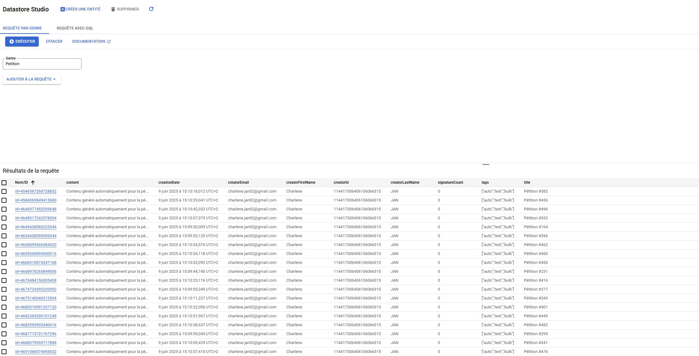
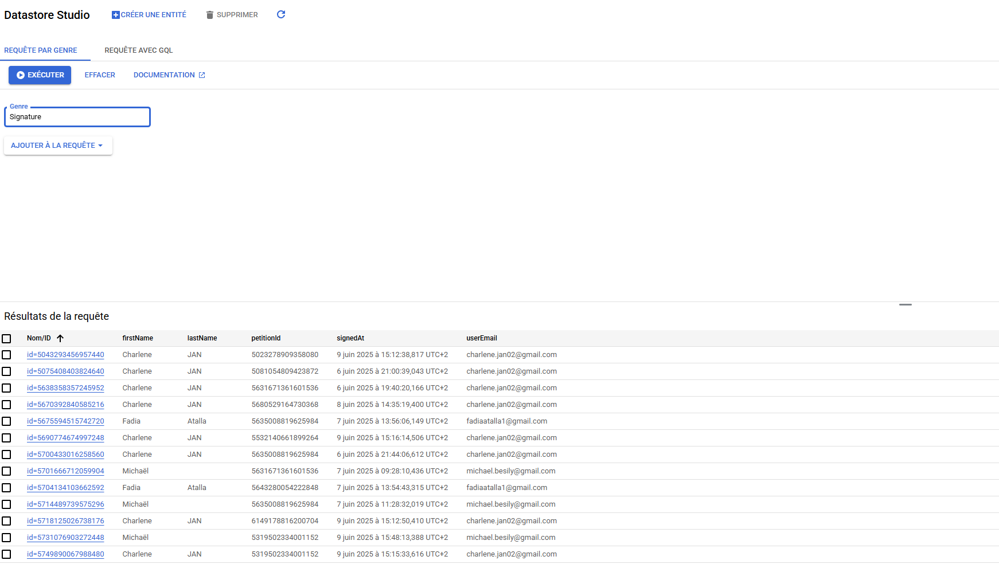
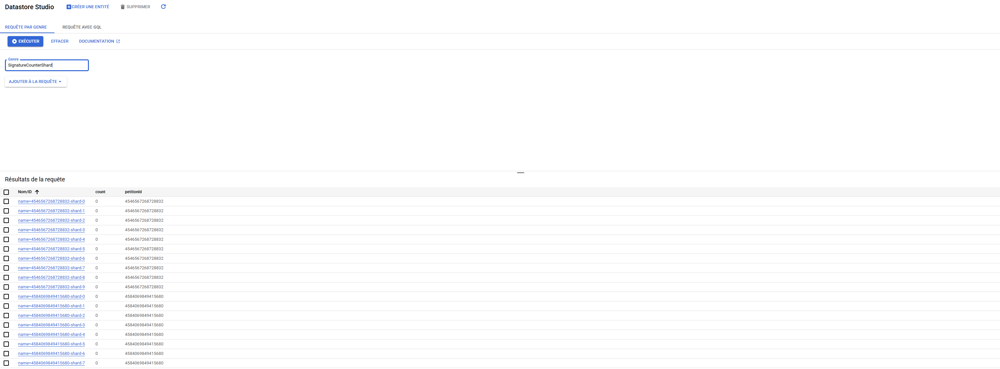
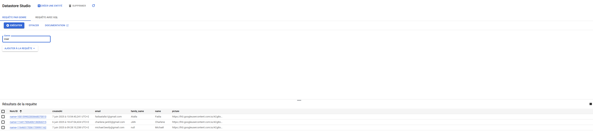

# TinyPet

## Auteurs
- **ATALLA Fadia**
- **BESILY Michaël**
- **JAN Charlène**

## Description du projet
TinyPet est une application web de pétitions, inspirée d’Avaaz et Change.org, permettant de soutenir des causes et de mobiliser une large communauté. L’application est conçue pour gérer des millions de pétitions et de signatures, tout en offrant une interface efficace et moderne.

## Fonctionnalités
- **Créer une pétition** : Les utilisateurs peuvent rédiger et publier leurs propres pétitions.
- **Signer une pétition** : Un utilisateur authentifié ne peut signer une pétition qu’une seule fois.
- **Lister les pétitions signées** : Chaque utilisateur peut voir la liste de ses pétitions signées, triées par date.
- **Top 100 des pétitions** : Affichage des 100 pétitions les plus récentes (ou plus anciennes), triées par date.
- **Recherche par tag** : Filtrer les pétitions par tag, triées par date de création.
- **Voir les signataires d’une pétition** : Affichage de toutes les personnes ayant signé une pétition donnée.

## Extensions

- **Gestion frontend de la connexion utilisateur** : L’authentification est totalement gérée côté frontend (Angular), avec affichage dynamique du statut utilisateur connecté/déconnecté et accès conditionnel aux actions sensibles (création, signature).
- **Filtre dynamique et recherche avancée** :  
  - **Recherche multi-critères** : L’interface permet de filtrer dynamiquement la liste des pétitions :  
    - Par **nom**, **prénom** ou **adresse e-mail** du créateur ou d’un signataire.
    - Par **tag** (mot-clé) associé à une pétition.
    - Par **popularité** : tri croissant ou décroissant selon le nombre de signatures.
    - Par **date de création** : croissant ou décroissant.
  - **Combinaison des filtres** : Tous ces filtres et tris sont utilisables en même temps, de manière fluide.


> **Scalabilité** : L’application est conçue pour supporter des millions de pétitions et de signatures, avec une architecture optimisée côté backend et stockage.

## Technologies utilisées
- **Frontend** : Angular
- **Backend** : REST API avec Google Cloud Endpoints (Java)
- **Base de données** : Google Datastore (scalable)
- **Gestion du projet** : Maven

## Déploiement et accès

- **URL de l’application (Google App Engine)** :  
  [https://tinypet-atalla-besily-jan.ew.r.appspot.com/](https://tinypet-atalla-besily-jan.ew.r.appspot.com/)

- **URL du code source (GitHub)** :  
  [[GitHub TinyPet](https://github.com/Michael16b/TinyPet)]

## Installation et utilisation

### Prérequis
- **Maven**
- **Node.js et npm** (pour la partie Angular)
- **Google Cloud SDK** (pour le déploiement)

### Frontend (Angular)
1. Clonez le dépôt :
    ```bash
    git clone https://github.com/Michael16b/TinyPet.git
    cd TinyPet/frontend
    ```
2. Installez les dépendances :
    ```bash
    npm install
    npm run build
    ```

### Backend (Google Cloud Endpoints Java)
1. Allez dans le dossier backend :
    ```bash
    cd TinyPet/backend
    ```
2. Compilez le backend :
    ```bash
    mvn package -Dskip.npm
    ```
3. Lancez le backend en local :
    ```bash
    mvn appengine:run
    ```
4. (Déploiement) :
    ```bash
    gcloud init
    mvn appengine:deploy
    ```

## Architecture

- **UI** : Angular communiquant avec des endpoints REST sécurisés (utilisateurs authentifiés).
- **Services REST** : développés en Java, déployés sur Google App Engine, exposant les opérations CRUD, la recherche, le tri et l’authentification.
- **Stockage** : Google Datastore, optimisé pour des volumes massifs de données (pétitions et signatures).

## Screenshots des “Kinds” Google Datastore

### Petition :


### Signature :


### Signature CounterShard :



### User :


## Qu’est-ce qui fonctionne ?

- Authentification utilisateur (Google OAuth).
- Création et signature de pétition.
- Unicité de la signature (pas de double signature possible).
- Liste des pétitions signées, triées par date.
- Affichage du top 100 des pétitions, triées par date.
- Recherche de pétitions par tag, triées par création.
- Affichage de tous les signataires d’une pétition.
- Insertion de 500 pétitions en 1min30.

## Qu’est-ce qui ne fonctionne pas ?

- **Limitation des requêtes Datastore sur les filtres IN**  
  Lorsque l’on souhaite lister toutes les pétitions signées par un utilisateur, il faut souvent faire une requête sur le Datastore avec un filtre de type `IN` sur les IDs de pétitions signées. 
  Cependant, Google Datastore impose une **limite d'une requête unique contenant des opérateurs `NOT_EQUAL` ou `IN`   à 30 sous-requêtes.** ([source officielle](https://cloud.google.com/appengine/docs/legacy/standard/java/datastore/queries?hl=fr))

